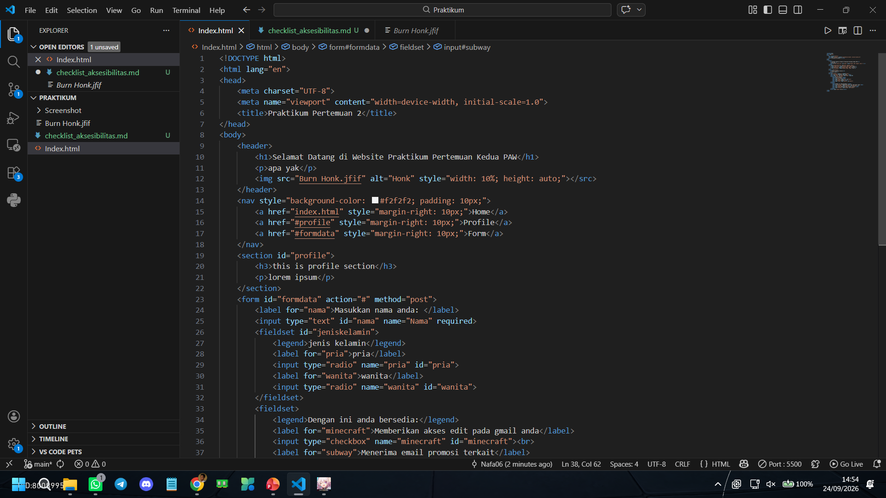
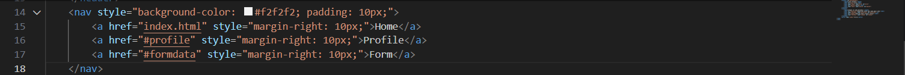
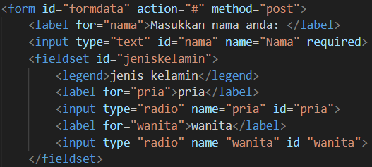
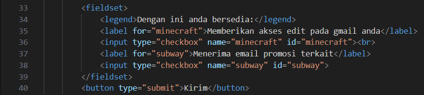
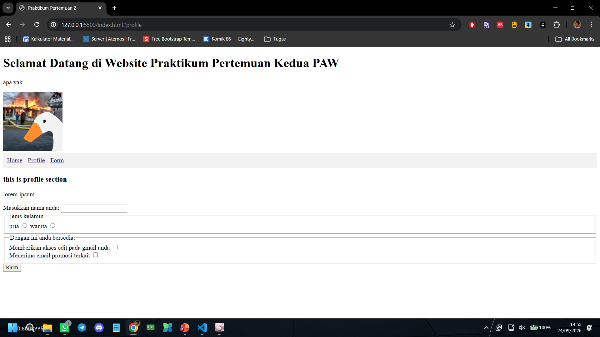
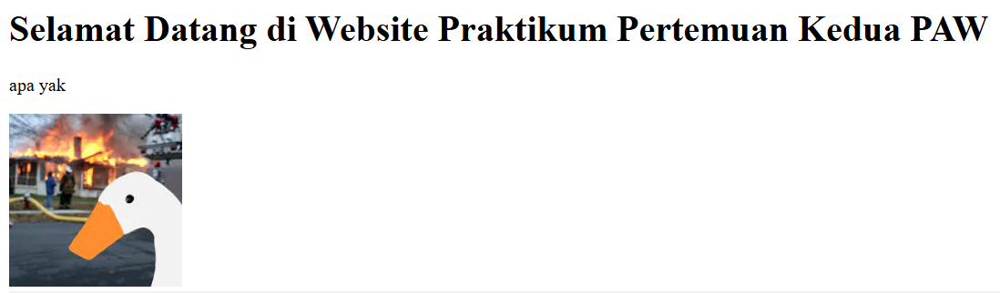
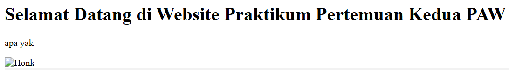

# Checklist Syarat Submission

- [✓] **Struktur HTML5 minimum lengkap**
  

- [✓] **Elemen semantik digunakan tepat**
  

- [✓] **Form memiliki label, id, name, dan required bila perlu** 
  

- [✓] **Radio/checkbox dikelompokkan dengan fieldset dan legend**
  

- [✓] **Heading berurutan dan halaman memiliki title**
  

- [✓] **Setiap gambar bermakna memiliki alt text**
  
  